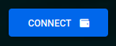

<div id="top"></div>

<!-- Project Photo -->
<br />
<br />
<div align="center">
    
<br />
<br />
<h1 align="center"><strong>Html Fund Me</strong></h1>
  <p align="center">
    This is my restyling of the Html FundMe project develop by Patrick Collins for <a href="https://www.freecodecamp.org/">FreeCodeCamp</a>
    <br />
    <br />
    <br />
  </p>
</div>

# Requirements

-   [git](https://git-scm.com/book/en/v2/Getting-Started-Installing-Git)
    -   You'll know you've installed it right if you can run:
        -   `git --version`
-   [Metamask](https://metamask.io/)
    -   This is a browser extension that lets you interact with the blockchain.
-   [Nodejs](https://nodejs.org/en/)
    -   You'll know you've installed nodejs right if you can run:
        -   `node --version` And get an ouput like: `vx.x.x`
-   [Yarn](https://classic.yarnpkg.com/lang/en/docs/install/) - You'll know you've installed yarn right if you can run: - `yarn --version` And get an output like: `x.x.x` - You might need to install it with npm

# Quickstart

1. Clone the repo:

```
git clone https://github.com/giano95/html-fund-me-fcc
cd html-fund-me-fcc
```

2. Run the `index.html` file:

You can usually just double click the file to "run it in the browser". Or you can right click the file in your VSCode and run "open with live server".

3. Connect your Metamask wallet:

In the browser at the right top of your page you should see a small button that says "connect". Hit it and you should see metamask pop up, then go ahead and connect your wallet.



# Usage

1. If you want to execute a transaction you need the [Hardhat Fund Me] project installed on your computer, in order to do that open up a second terminal and run:

```
git clone https://github.com/giano95/hardhat-fund-me-fcc
cd hardhat-fund-me-fcc
```

2. Deploy a sample contract and start a local hardhat blockchain on your computer:

```
yarn
yarn hardhat node
```

3. Update your `constants.js` with the new contract address.

In your `constants.js` file, update the variable `contractAddress` with the address of the deployed "FundMe" contract. You'll see it near the top of the hardhat output.

4. Connect your [metamask](https://metamask.io/) to your local hardhat chain.

In the output of the above command, take one of the private key displayed in the hardhat output and [import a new account into your metamask](https://metamask.zendesk.com/hc/en-us/articles/360015489331-How-to-import-an-Account).

5. Add your chain to [Metamask](chrome-extension://nkbihfbeogaeaoehlefnkodbefgpgknn/home.html#settings/networks/add-network):

Chose a Network Name, insert `http://127.0.0.1:8545/` as the New RPC URL, `31337` as the Chain ID and `ETH` as the Currency Symbol.

6. Now go ahead and play with the HTML page using the `Fund` and `Withdraw` button!

# Thanks

A special Thanks to [Patrick Collins](https://github.com/PatrickAlphaC/) for creating this project and help other peoples to get in Blockchain development! Here you can find his original [repo](https://github.com/PatrickAlphaC/html-fund-me-fcc/) and here the [video course](https://www.youtube.com/watch?v=gyMwXuJrbJQ) he made for FreeCodeCamp.org.

<p align="right">-<a href="#top"> back to top </a>-</p>
